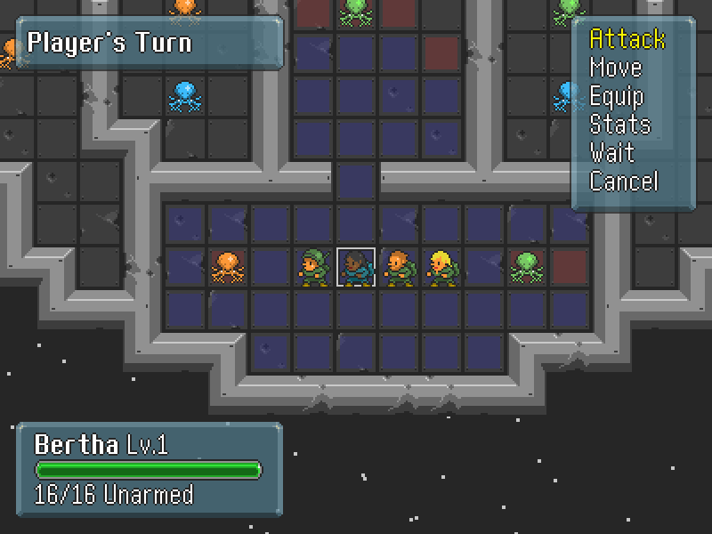

# Space Strategy

## Overview
Grid-based tactics game. Uses Dijkstra's algorithm for enemy AI pathfinding, as well as for displaying player-controlled units' movement cells. Work in progress. Graphics courtesy of **[Oryx Design Lab](https://www.oryxdesignlab.com/sprites/)**.

## Dependencies
* **[Pygame](https://www.pygame.org/news)** 1.9.3+
* **[Python](https://www.python.org/)** 3.4+
